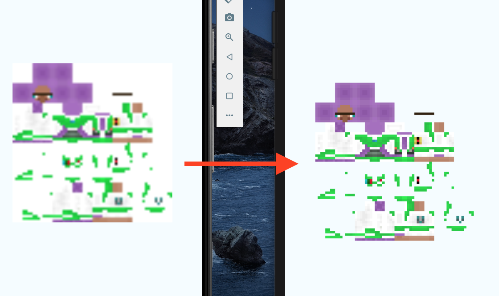
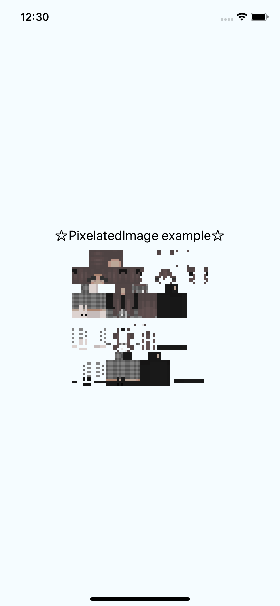
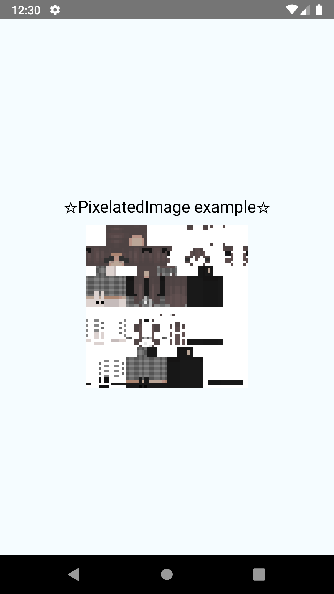

# react-native-pixelated-image

`react-native-pixelated-image` display small images (64x64) wit antialias disabled/Pixelated.
In ios you can easy edit RCTImageView , but this is automatic changed when run pod install... 
```layer.magnificationFilter = .nearest.```

Also in android if you set antialiasing is not working as expected. Need to add an extra step :
```
drawable.setAntiAlias(false);
drawable.setFilterBitmap(false);
```



</br>
</br>
</br>

Result: Ios | Android





</br>
</br>
</br>

## Getting started

```bash
$ npm install react-native-pixelated-image --save
```
```
cd ios 
pod install
```
### Mostly automatic installation

`$ react-native link react-native-pixelated-image`

## Usage
```javascript
import PixelatedImage from 'react-native-pixelated-image';

```

```javascript
<PixelatedImage
          status={true}
          source={"data:image/png;base64,iVBORw0KGgoAAAANSUhEUgAAAEAAAABACAMAAACdt4HsAAAAbFBMVEUAAAAFBQUSEhIVFBQXFxcXFxwZGRkwMDBOQ0NRRUVSUlJTU1NUVFRVVVVWVlZXR0dXV1dbTExcTk5hUFBsbGxtbW2Dg4OEhISljYerhHGrhXC0o5q0tLS4koW4koa7ppfFu7rc0tDd09Dn5+e+gBNlAAAAAXRSTlMAQObYZgAAAvhJREFUWMPdlouW4iAMhtF2W6JVZInt7IzaEd//HSfh1otWrbs7e85m5gDF8vFDkoIQwaSUANKZq8XIfA+VmmstrkyC0loFxC2A4lJJMWU8MXTjp1+cMlDO0jJeAGhjNAOOZC8A0hKOLdlx/hLSJr4MiG58BJCpuO3/63piuhgXWSaVkvSqe9vV9Jxlvp/LNEjrBFMyxQVktHjQHYAeFHX6/gyyOIb6DaQIzEJ/JkCDoh/IA7/IKBA0GC5ifx6HGAaY+PQjd02Td4CyPB7L8grQeVloI6DbEhMKqViqKksPcAjqkqFfBtFl6TOIa7cg7ZNKC79pNP/HW9u+fZQlpE11te4nY1fr0K+v/D+Z1mP/99MaV7iy1n6mvAhWa84PXcf+PM+KIr8RFhXWeAuAFVb0j31A+ySgbecAbizBAWqoES9wfwk8B25xu0HcrHGNHMNkpxOXvu0sd5Y5y/sQmqOu0ZdU1Q4A9D670rfJGyALZx5QFGMFO9xFBTSNdO8zwLd7AK9jABgroN8pjBlA4fwMYLwHDmAYYBjAOaHpH+YpmAMgBdZu7UgBvQ/PK7AWbV9BHgF+P1w4TwMog6xt7buzU9vu12tFYw9bVlBVNJwBRk8CrLdPZ9QgHTRrc8ADeWGPzwEWdpEApABgu79sSMOrCpoGGsQDNA23/R40k4D/3fijfoG/PAl9bup68Og+vvTNmHXC46AajQWYqUD600T7QwEYALMUSOnPPQ/QfArpmQr6gO4Ym7TzWZyHe2BSMWxPKOgA0QtDgDH3AGIIEPuKB+Fhe+BB1Z6f7g63NrZ8Njq3eS949wUF97LxTDb2+yX534ifjwB/PgforEWeL13J5n5E6OtcjQHttwJ+awl8QtFRie7MpKMqXAjC9eBOQMaciCdUPDPDhSBcDx4kIzdYAV0XkoLg+BAGLyh4DjBS0N+Df6Ng9/0KlmK57MdBsSsKr2A1G+AuGkVbFHx5b0/vY8AVsAvR4qY9BHgFy6TA/bCgvwnA2L4AK3VdRrYhDL4AAAAASUVORK5CYII="}
          onClick={(s) => { console.log(s); }}
          style={{ width: 200, height: 200 }}
        />
```

## Platform Supported
* [x] Android
* [x] iOS

## History

